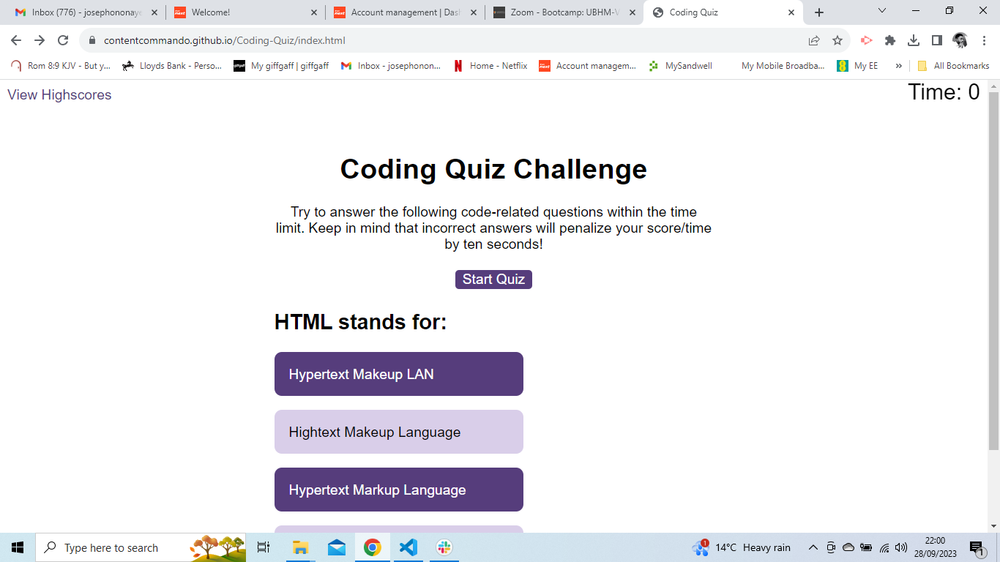

# Coding-Quiz
This is an application that features quizzes on coding. It
helps the user test their knowledge on the subject and shows
results of how they  have performed by displaying a score at the end.

## Functionalities

Work is still ongoing on this project but below are the current
features and functionalities on the application based on set criteria.

* The quiz timer is installed and set to a maximum of 60 seconds.
At the click of the start button, the timer starts reading and the first quiz is
available on the screen.

* Each question set contains buttons for each answer four answer options. On clicking any of these
buttons, the user immediately sees whther their selected option is rigth or wrong.

* When option is selected, the user can click next to move to the next question. There are
a total four questions at this stage of the project.

## Future Work 
* To write additial code that subtract time from the clock when an incorrect option is selected.

* When the game ends, it should display the user's score and give the user the ability to save their initials and their score.

* To also make the code DRY.

Here is [link](https://contentcommando.github.io/Coding-Quiz/index.html) to the deployed application.

## Mock-up

